<p align="center">
  
</p>
# 🤖 AI-Based PCB Defect Detection and Inspection System using YOLOv8


---

## 📌 Project Overview

Printed Circuit Boards (PCBs) are the foundation of modern electronic systems. Traditional PCB inspection is performed manually, making it time-consuming, labor-intensive, and susceptible to human error.

This project presents an **AI-Based PCB Defect Detection and Inspection System** powered by **YOLOv8n** and **Computer Vision** to automatically identify manufacturing defects from PCB images. The system enables fast, accurate, and reliable quality inspection suitable for industrial environments.

---

# 🏭 Problem Statement

Manual PCB inspection:

- Time-consuming
- Expensive
- Error-prone
- Difficult to scale

This project automates the inspection process using Deep Learning to improve manufacturing quality and reduce inspection time.

---

# ✨ Features

- Automatic PCB defect detection
- YOLOv8n object detection model
- Multiple defect classification
- Bounding box visualization
- Confidence score prediction
- Streamlit Web Application
- Fast inference
- Easy-to-use interface
- Computer Vision based inspection

---

# 🧠 Defect Classes

The model detects six PCB defects:

| Class |
|--------|
| Mouse Bite |
| Spur |
| Missing Hole |
| Short |
| Open Circuit |
| Spurious Copper |

---
## 🏗️ System Workflow

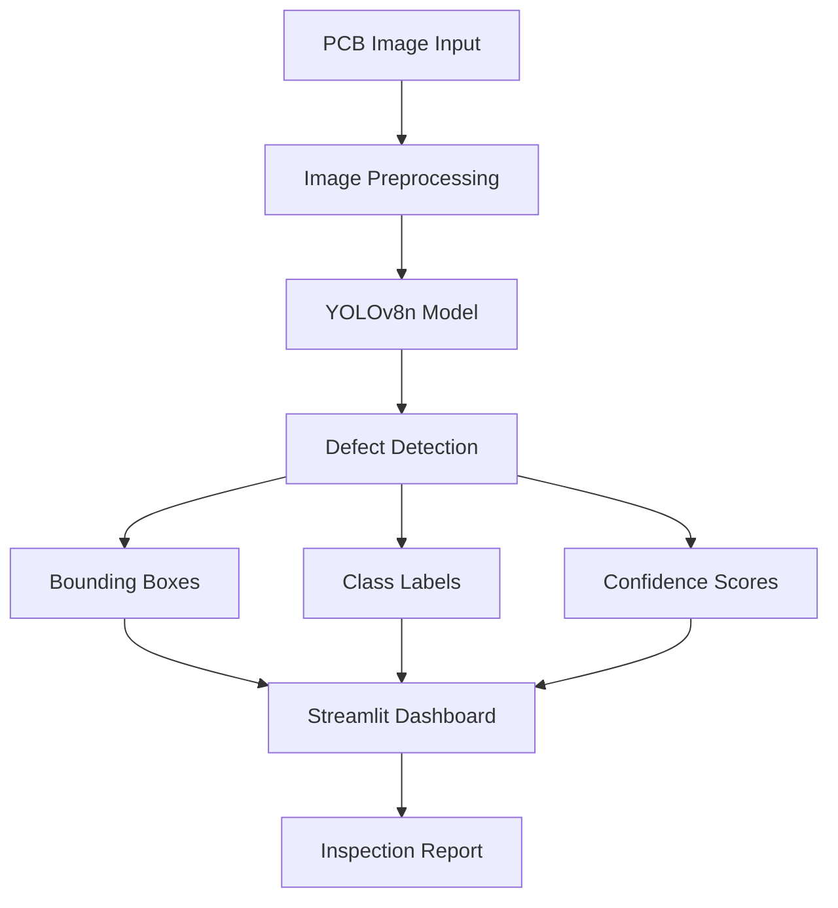

# 🛠 Technologies Used

- Python
- YOLOv8n
- Ultralytics
- OpenCV
- NumPy
- Streamlit
- VS Code

---

# 📂 Dataset

**Source:** Kaggle PCB Defect Dataset

The dataset contains annotated PCB images covering six common manufacturing defects.

---

# ⚙ Installation

Clone the repository

```bash
git clone https://github.com/24211a6657-sys/PCB_DEFECT_DETECTION_USING_YOLOv8.git
```

Move into the project directory

```bash
cd PCB_DEFECT_DETECTION_USING_YOLOv8
```

Install dependencies

```bash
pip install -r requirements.txt
```

---

# ▶ Run the Project

```bash
streamlit run app.py
```

or

```bash
python main.py
```

---

# 📈 Model Information

| Parameter | Value |
|------------|-------|
| Model | YOLOv8n |
| Framework | Ultralytics |
| Language | Python |
| Application | PCB Defect Detection |

---

# 📸 Results

The system predicts:

- Defect Name
- Confidence Score
- Bounding Box
- Detection Visualization

> 📷 Output screenshots will be added soon.

---

# 🚀 Future Enhancements

- Live camera inspection
- Conveyor belt integration
- Industrial deployment
- Edge AI optimization
- Cloud deployment
- Improved model accuracy
- Mobile application support

---

# 👨‍💻 Developed by

**Abhi Sathwika Goundla**

**B.Tech – CSE (AI-ML)**

**B V Raju Institute of Technology**

---

## ⭐ Support

If you found this project useful, consider giving it a ⭐ on GitHub.
# 📈 Model Training Results

The following plots were automatically generated during YOLOv8n training and provide insights into model convergence and performance.

## Training Metrics

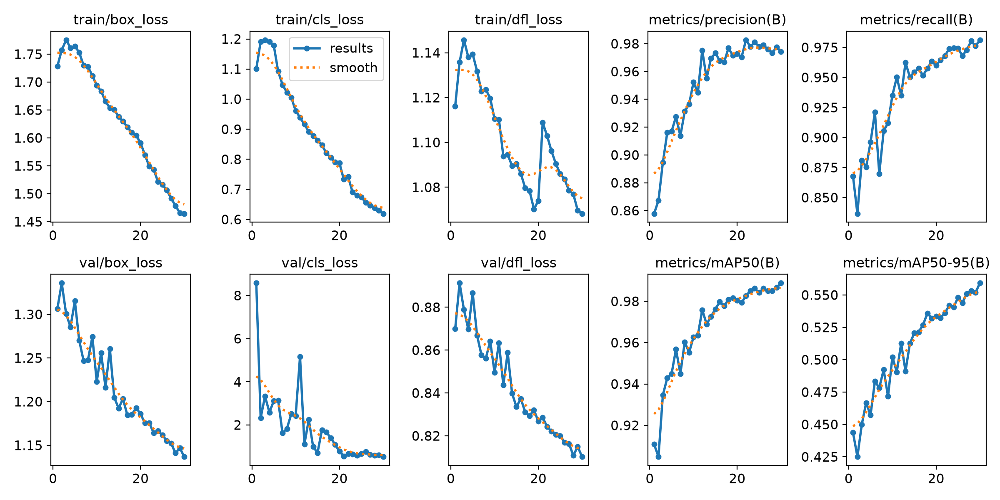

---

## Confusion Matrix

The confusion matrix illustrates the classification performance across all PCB defect classes.

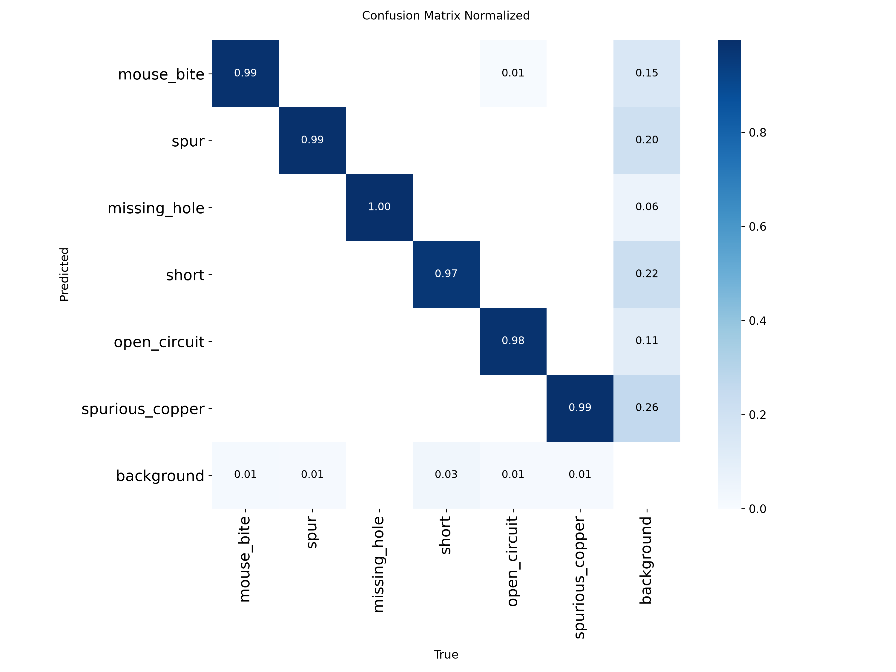

---

## Precision–Recall Curve

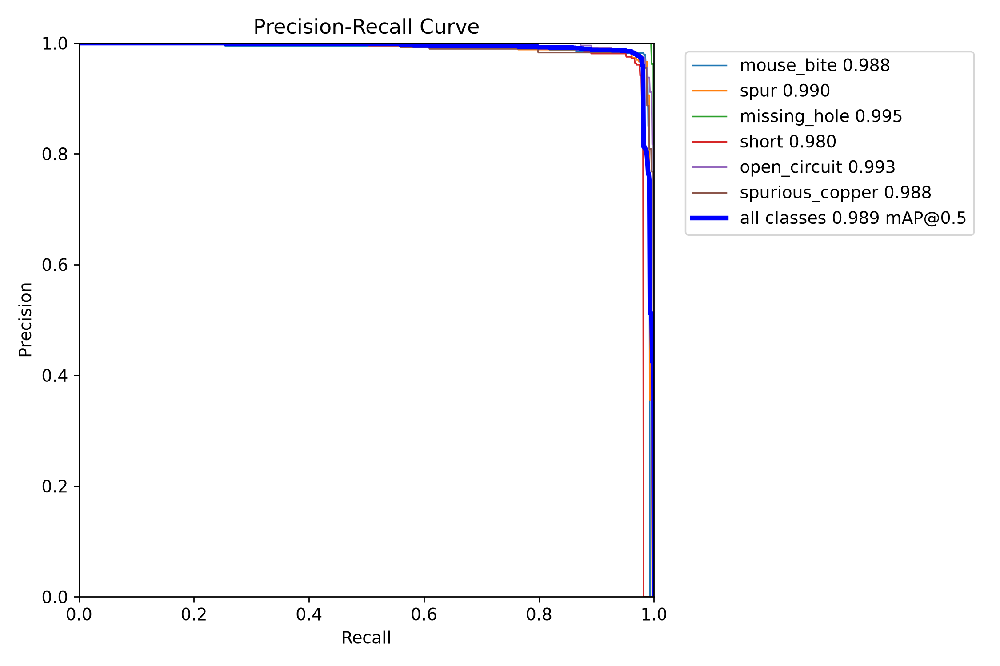

---

## Precision Curve

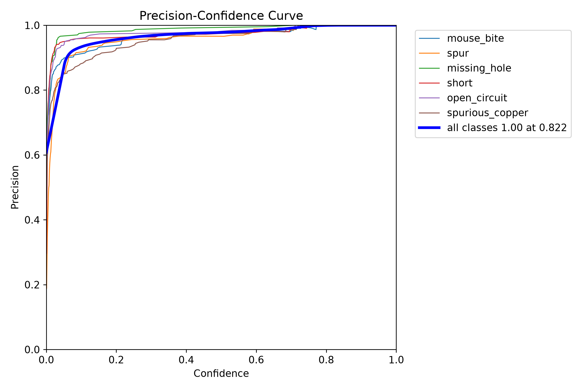

---

## Recall Curve

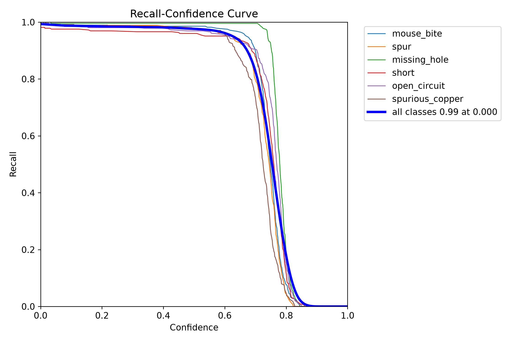

---

## F1 Score Curve

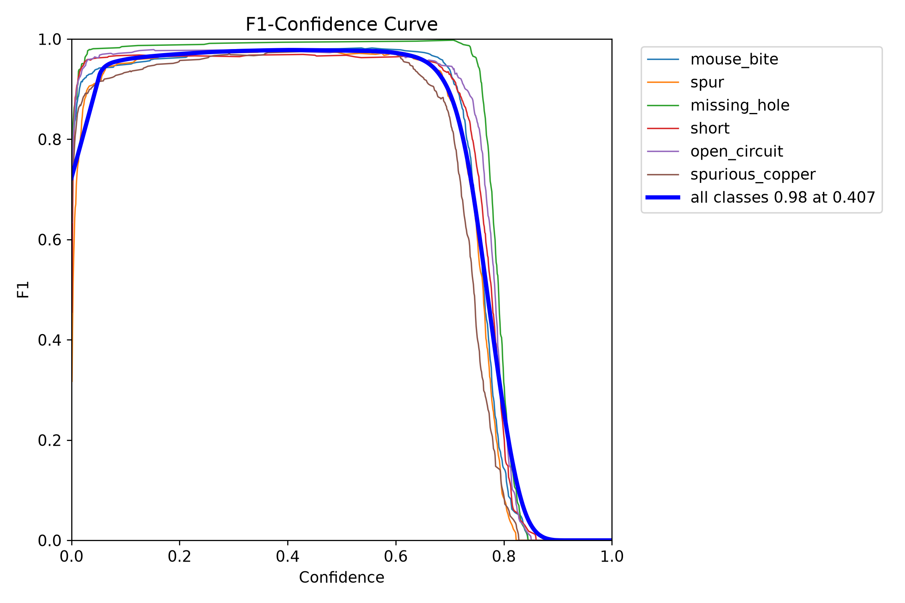

---

## Dataset Label Distribution

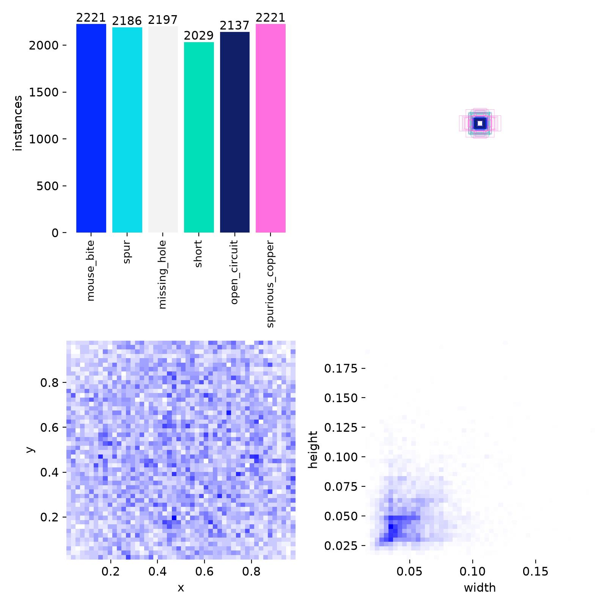
# 🔍 Sample Detection Results

The following examples demonstrate the model's ability to identify PCB defects with bounding boxes and defect labels.

|## 🔍 Sample Detection Results

### Prediction 1

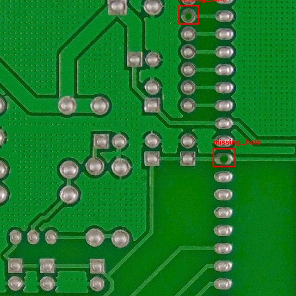

### Prediction 2

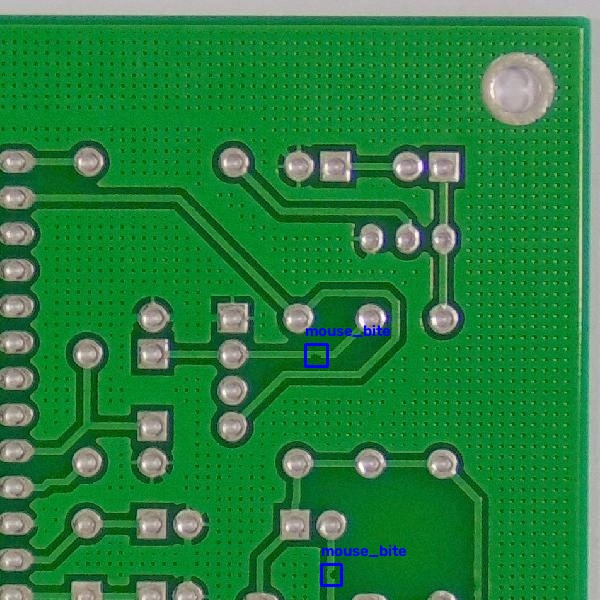

### Prediction 3

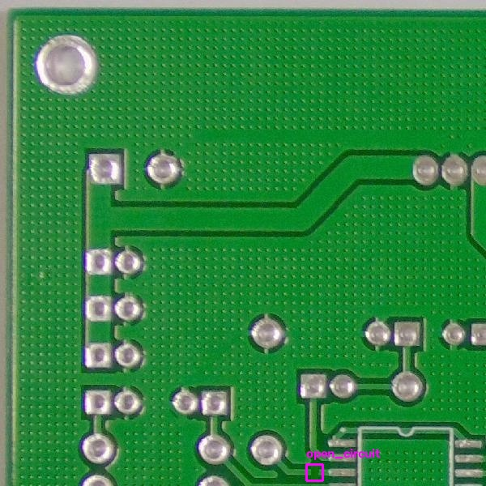

### Prediction 4

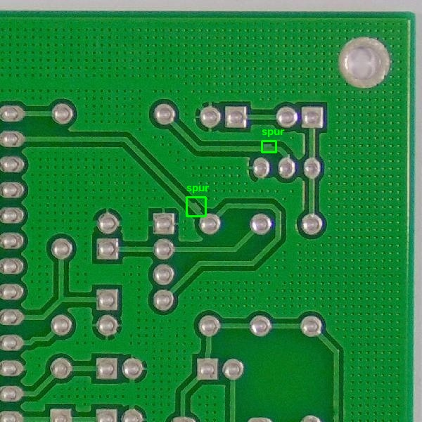